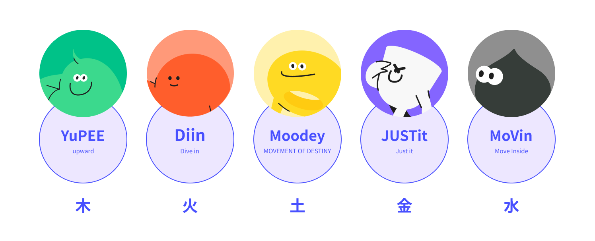
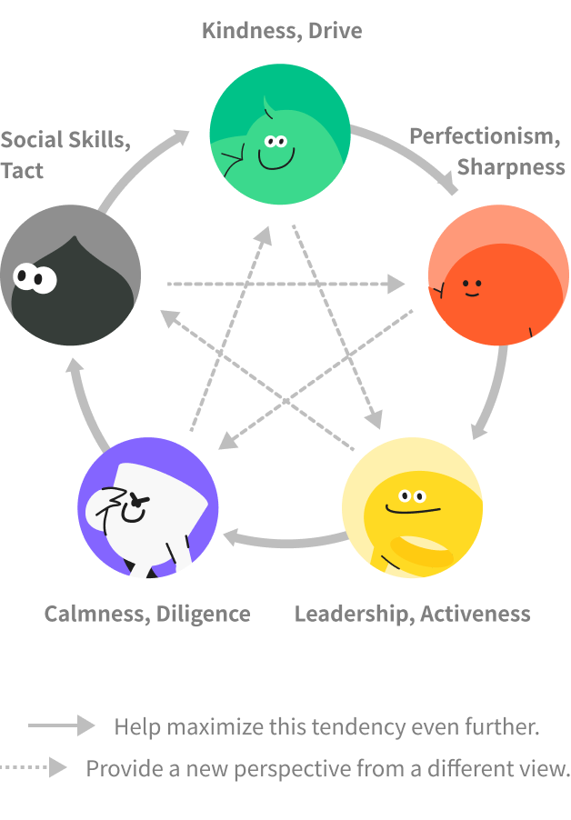

# TBOO - Find Your Character 🍀

A Saju-based character analysis service by TBOO.AI.

- Website: https://my.tboo.ai

## What is Saju (Four Pillars of Destiny)?

Saju is a destiny interpretation system based on Eastern philosophy, consisting of four pillars representing one's birth year, month, day, and time. Each pillar is composed of Heavenly Stems (天干) and Earthly Branches (地支), which are used to analyze an individual's innate personality and flow of destiny.

## Character Analysis Process

### Saju Information Verification

- Input birth date, time, and gender
- Calculate Hour Pillar, Day Pillar, Month Pillar, and Year Pillar
- Day Master (日干) determines the basic character

### Personality Analysis

Characteristics according to each element:

| Element | Key Characteristics      |
| ------- | ------------------------ |
| Metal   | Perfectionism, Sharpness |
| Water   | Sociability, Agility     |
| Wood    | Kindness, Drive          |
| Fire    | Leadership, Activity     |
| Earth   | Calmness, Diligence      |

### Character Relationships

- The relationships of mutual generation (相生) and mutual restraint (相剋) are not absolute good or bad, but understood as different roles
- Various synergies possible depending on situation and context

    

